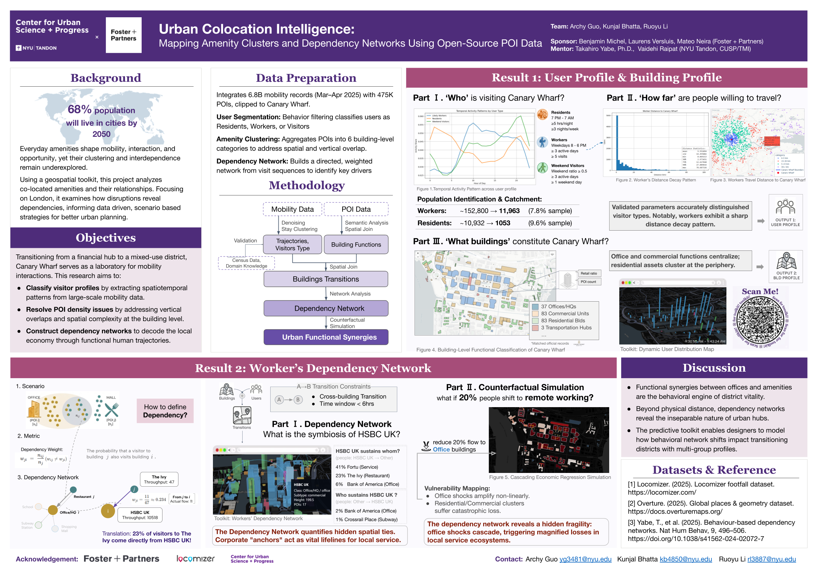

# Urban Co-location

This repository contains the research pipeline for studying urban co-location patterns in London. For this study, we select Canary Wharf as our primary research sample to investigate how various urban activities spatially and temporally co-locate through the integration of mobility data, Point of Interest (POI) datasets, and network analysis.

##  Interactive Platform
Come and check our results here! https://r-li.com/urban-colocation-intelligence/

##  Poster

##  Research Pipeline

| Step | Task | Description |
|------|----------|-------------|
| 1 | Building-level POI Distribution | Analysis of POI distribution patterns at the building level using Overture data |
| 2 | Visitor Type Identification | Identification and categorization of different visitor profiles based on mobility patterns |
| 3 | Dependency Network Construction | Construction of dependency networks across buildings to understand urban functional relationships |

##  Data Sources

- **Overture** — POI datasets and building-level place attributes
- **Locomizer** — Mobility data and home/work location inference (covering the period 2025/03 - 2025/04)
- **London LSOA** / Wards — Geographic and administrative boundary data for the London area

##  Visualizations

Interactive HTML outputs are stored in `Viz/`. Open any file directly in a browser.

##  Acknowledgment

We would like to express our sincere gratitude to Foster + Partners for sponsoring this project and providing professional guidance on the research direction. We also thank Locomizer for their generous support in providing the mobility datasets essential to this study.

##  Contact

For questions or contributions, please open an issue or pull request on [GitHub](https://github.com/archykool/Urban-Co-location).
